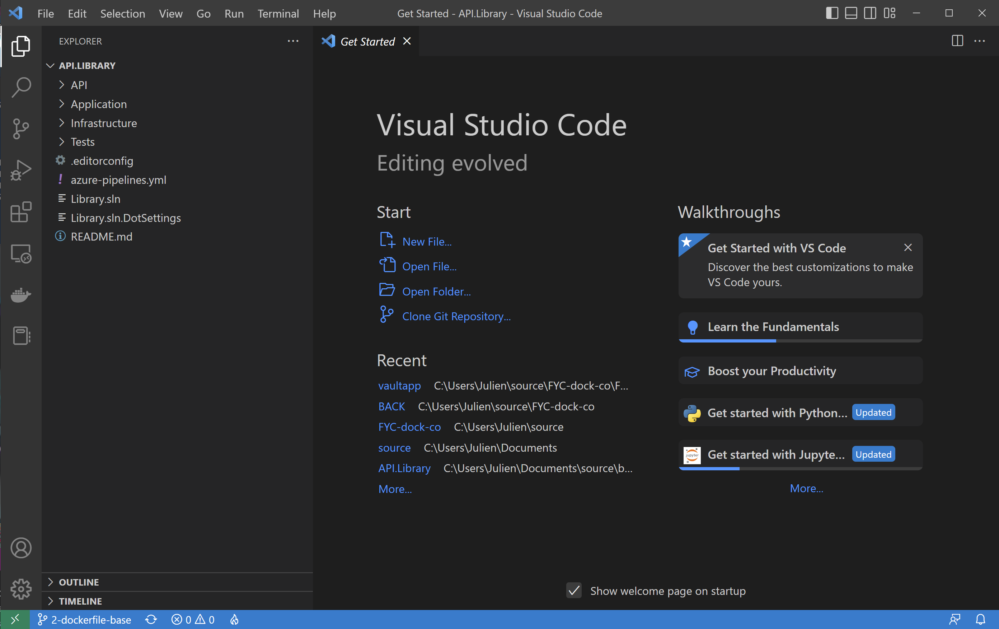
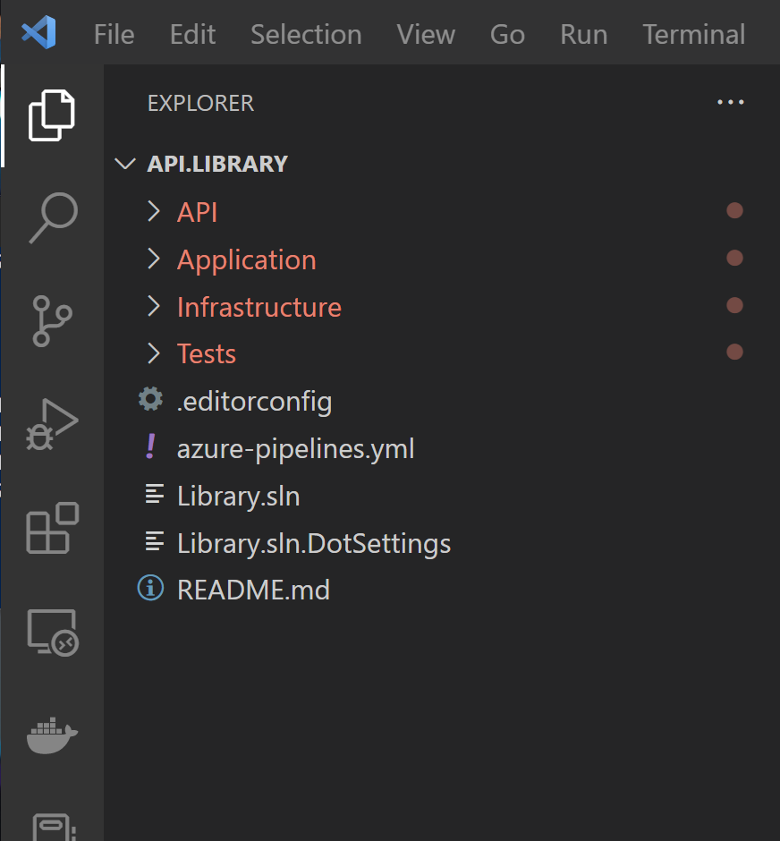

## Exercice accompagn� : Dockerfile d'une application Back-end

&nbsp;

Apr�s avoir vu la syntaxe et les instructions des Dockerfile, et apr�s avoir abord� le cache de Docker et le syst�me par couche des images, il est temps de s�exercer un peu avec un cas pratique ! 

Dans cet exercice accompagn�, nous allons cr�er de A � Z un Dockerfile qui nous permettra de cr�er une image Docker de notre application : une API Web qui fait office de Back-End dans notre solution.

&nbsp;

### 1) Avant de commencer

&nbsp;

Avant tout chose, il nous faut r�cup�rer les sources du projet : notre application Back-End. La solution compl�te comprend une partie Back-End et une partie Front-End, mais nous n'allons pas nous occuper de la partite Front-End pour le moment.

Le projet est disponible � l'adresse suivante : https://github.com/a-chatelard/FYC-dock-co/tree/2-dockerfile-base

&nbsp;

Nous devons cloner le d�p�t pour r�cup�rer les sources. Placez vous dans le dossier de votre choix et clonez le d�p�t git avec la commande suivante :
```
git clone -b 2-dockerfile-base https://github.com/a-chatelard/FYC-dock-co.git
```

&nbsp;


&nbsp;

Apr�s avoir clon� le d�p�t sur notre machine, nous pouvons passer � la cr�ation de notre premier Dockerfile !

&nbsp;

### 2) Cr�ation du Dockerfile 

&nbsp;

Comme expliqu� pr�c�demment dans ce cours, tout �diteur de texte peut faire l'affaire pour cr�er un fichier Dockerfile. N�anmoins il y a une solution � la fois gratuite et l�g�re, qui offre une bonne int�gration de Docker, et c'est la solution que je vous propose pour cr�er ce premier Dockerfile : nous allons utiliser Visual Studio Code.


Vous pouvez vous placer directement dans le dossier de l'application Back-end afin de l'ouvrir dans VS Code. Voici le chemin du dossier en question :

``/dossier_du_depot_git/BACK/API.Library``

&nbsp;



&nbsp;

Voici les �l�ments qui devraient s'afficher dans votre explorateur de fichier VS Code si vous vous �tes plac� dans le bon dossier :

&nbsp;



Certains �l�ments apparaissent en rouge dans l'explorateur, ce qui est synonyme d'erreur. Pas d'inqui�tude cependant, ces erreurs ne nous g�nerons pas pour la cr�ation de notre Dockerfile !

&nbsp;

Si toute fois vous souhaitiez absolument corriger ces erreurs, il suffit d'ouvrir un terminale et de taper la commande suivante : dotnet restore

&nbsp;

Il ne nous reste plus qu'� cr�er un fichier que vous nommerez sobrement Dockerfile (pour rappel le fichier ne doit pas utiliser d'extension).


&nbsp;

Nous pouvons passer � la partie la plus int�ressante de cet exercice : les instructions du Dockerfile !

&nbsp;

### 3) Des instructions pour notre Dockerfile

&nbsp;

Qu�allons-nous mettre dans notre Dockerfile ? Si vous avez bien suivi le cours, vous savez que tous les Dockerfile commencent par une instruction ``FROM`` : elle nous permet de sp�cifier l�image de base pour notre projet.

Nous allons r�cup�rer une image du SDK (Software Development Kit) du framework .NET 6. Le SDK va nous permettre de compiler notre projet. 

&nbsp;

Voici l'instruction � placer tout en haut de votre Dockerfile :
```
FROM mcr.microsoft.com/dotnet/sdk:6.0 as build
```
Vous avez remarquer � la fin le "as build" ? cet option nous permet de donner un nom � cet image "temporaire". Ce nom nous permettra de manipuler cette image plus loin dans le Dockerfile.

&nbsp;

Ensuite nous allons faire appel � l'instruction ``WORKDIR`` pour sp�cifier le chemin qui sera utilis� pour les commandes suivantes.
```
WORKDIR /var/tmp
```

&nbsp;

Il est temps de copier les sources du projet et de compiler ce dernier afin d�obtenir la version ex�cutable de notre application !
```
COPY . ./
```

Si vous avez bien suivi, l�argument ``.`` qui permet d�indiquer le dossier courant va nous permettre de copier tous les �l�ments pr�sents dans le dossier o� se trouve actuellement notre Dockerfile (en l�occurrence, il s�agit du dossier API.Library). Les �l�ments copi�s vont �tre ajout�s � l�image Docker � l�emplacement indiqu�, c�est-�-dire l�emplacement courant dans l�image. Il s�agit du dossier ``/var/tmp``, puisque c�est l�emplacement que nous avons indiqu� avec l�instruction ``WORKDIR`` !

&nbsp;


```
RUN dotnet restore
RUN dotnet publish -c Release -o out
```

Les deux instructions ``RUN`` permettent d�ex�cuter des commandes dans le shell de l�image Docker. La premi�re permet de restaurer les d�pendances de notre projet.

&nbsp;

La commande ``dotnet publish -c Release -o out`` nous permet de publier (compiler) notre application en mode release, l�option ``-o`` sp�cifie le dossier dans lequel enregistrer tous les fichiers cr��s par l'�tape de compilation. (Ces commandes sont sp�cifiques aux projets .NET, elles ne seraient d'aucune utilit� pour tout autre type de projet, comme une application �crite en Java ou en Go.)

&nbsp;

Que faire ensuite ? nous avons une image qui contient la version publi�e de notre application, mais est-ce suffisant pour cr�er un conteneur ? Il nous manque encore quelques �l�ments pour arriver au r�sultat souhait�.

Nous allons maintenant r�cup�rer une nouvelle image, il s�agit du runtime .NET 6 qui nous servira � ex�cuter notre application dans notre futur conteneur !
```
FROM mcr.microsoft.com/dotnet/aspnet:6.0
```

&nbsp;

Nous allons changer le r�pertoire de travail et nous allons copier le r�sultat de la commande dotnet publish dans un nouveau dossier :

```
WORKDIR /app
COPY --from=build /var/tmp/out ./
```

Avez-vous remarqu� l�option ``�from`` dans l�instruction ``COPY`` ? Elle nous permet de r�cup�rer des fichiers � partir d�une autre image, la premi�re que nous avons int�gr� dans le Dockerfile. Avec la 2�me instruction ``FROM``, nous avons changer d�image, celle-ci poss�de un syst�me de fichier qui n�est pas partag� avec celui de la premi�re image, celle qui est bas�e sur le SDK !

Heureusement l�instruction ``COPY`` nous permet de r�cup�rer des fichiers depuis une autre image. Nous allons r�cup�rer uniquement les �l�ments pr�sents dans le dossier ``/var/tmp/out``, souvenez-vous il s'agit du r�sultat de la compilation de notre application. De fait dans la version finale de notre image Docker, il ne restera que la version compil�e de notre application, et non l�int�gralit� des fichiers du projet.

&nbsp;

Nous arrivons � la fin, il nous reste � d�finir la commande que le conteneur devra ex�cuter pour d�marrer notre application, � la cr�ation du conteneur et apr�s chaque red�marrage de ce dernier. Quelle instruction va nous venir en aide cette fois-ci ? L�instruction ENTRYPOINT :

```
ENTRYPOINT ["dotnet", "Library.API.dll"]
```

&nbsp;

### 4) Version finale du Dockerfile

&nbsp;

Voici � quoi devrait ressembler votre Dockerfile :


```
FROM mcr.microsoft.com/dotnet/sdk:6.0 as build
WORKDIR /var/tmp
 
COPY . ./
RUN dotnet restore
RUN dotnet publish -c Release -o out
 
FROM mcr.microsoft.com/dotnet/aspnet:6.0
WORKDIR /app
COPY --from=build /var/tmp/out ./
ENTRYPOINT ["dotnet", "Library.API.dll"]
```

Sauvegardez votre fichier. Il temps d�sormais de cr�er notre image Docker, et de cr�er un conteneur � partir de cette image !

&nbsp;

Comment cr�er une image ? C�est la commande ``docker build`` qui va nous �tre utile ici.

A l'aide d'un terminal, placez-vous dans le r�pertoire o� se trouve votre Dockerfile et ex�cutez la commande suivante :
```
docker build . -t back_vault
```

Ici nous donnons le tag "back_vault" mais n'importe quel autre nom fera l'affaire.


&nbsp;

La commande docker run nous permet de cr�er un conteneur � partir de notre image nouvellement cr�er. (si vous avez changer le tag associ� � votre image dans le commande pr�c�dente, il faut changer le tag � la fin de la commande docker run avec celui que vous avez choisi.)
```
docker run -d -p 5000:5000 back_vault
```

&nbsp;

L'application �coute sur le port 5000 ; pour v�rifier que tout c'est bien pass�, vous pouvez ouvrir un navigateur et tenter d'acc�der au conteneur � l'adresse suivante :

``http://localhost:5000/swagger/index.html`` 

&nbsp;

Vous devriez arriver sur l'interface Swagger de l'API qui s'ex�cute dans le conteneur.

&nbsp;


&nbsp;

F�licitations ! Vous venez de cr�er votre premier Dockerfile et votre premi�re image Docker.

Dans l'exercice suivant, vous allez devoir cr�er une image Docker pour la partie Front-End de la solution pr�sent�e dans ce cours. Cette fois vous devrez vous d�brouiller seul pour concevoir le Dockerfile.

&nbsp;

&nbsp;

## Exercice : Dockerfile d'une application Front-end

&nbsp;

Voici un nouvel exercice pour vous entra�ner � l'�criture de fichier Dockerfile : vous allez �crire un nouveau Dockerfile pour notre application Front-end !

&nbsp;

Pour ce faire vous aurez besoin de r�cup�rer les sources du projet (si ce n'est pas d�j� fait) et cr�er un nouveau Dockerfile pour l'application Front-End.

Le projet Front-end est une application web d�velopp�e avec Angular, vous aurez donc besoin de compiler le projet en ligne de commande. Voici un lien vers la documentation https://angular.io/cli.

&nbsp;

Vous aurez �galement besoin d'une image avec node.js, pour compiler le projet, et une autre image avec un server web. Voici deux images qui peuvent convenir :

- [nginx/alpine](https://hub.docker.com/_/nginx)

- [node/alpine](https://hub.docker.com/_/alpine)

&nbsp;

Voici en vid�o la correction de cet exercice :

https://www.youtube.com/watch?v=mUtrUlorh-A&t=5s

&nbsp;

&nbsp;

## Dockerfile : base de donn�es

&nbsp;

Pour la base de donn�es, nous vous demandons juste de cr�er un fichier nomm� Dockerfile (sans extension) dans le r�pertoire BACK/SQL.Scripts du projet.

&nbsp;

Dans ce fichier, �crivez les instructions suivantes : 

```
FROM mcr.microsoft.com/mssql/server:latest

ARG A_SA_PASSWORD=@Password123
ARG A_ACCEPT_EULA=Y

ENV SA_PASSWORD ${A_SA_PASSWORD}
ENV ACCEPT_EULA ${A_SA_PASSWORD}

ENV MSSQL_PID Developer
ENV MSSQL_TCP_PORT 1433

WORKDIR /var/tmp

COPY vault_library_create_database.sql ./vault_library_create_database.sql
COPY vault_library_create_tables.sql ./vault_library_create_tables.sql

RUN (/opt/mssql/bin/sqlservr --accept-eula & ) | grep -q "Service Broker manager has started" && /opt/mssql-tools/bin/sqlcmd -S 127.0.0.1 -U sa -P ${A_SA_PASSWORD} -i vault_library_create_database.sql && /opt/mssql-tools/bin/sqlcmd -S 127.0.0.1 -U sa -P ${A_SA_PASSWORD} -i vault_library_create_tables.sql
```

&nbsp;

Sauvegardez le fichier.
Ouvrez un terminal et placez vous dans le dossier parent du Dockerfile.
Vous pouvez maintenant cr�er une image de la base de donn�es avec la commande  : 
docker build -t bdd_vault .
En ligne de commande, listez les images pr�sentes en local pour v�rifier la cr�ation de cette nouvelle image.

&nbsp;

Pour lancer cette image, saisissez la commande suivante : 
```
docker run -d -p 1433:1433 --name sql-server bdd_vault
```

&nbsp;

Vous pouvez v�rifier qu'un conteneur est cr�� en listant les conteneurs pr�sents en local sur votre machine.

&nbsp;