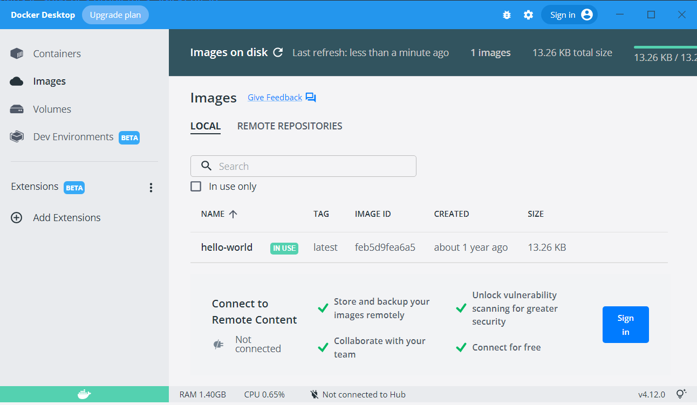
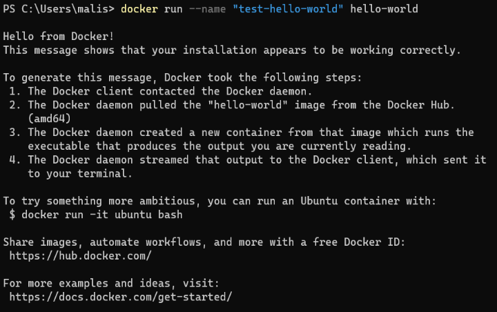
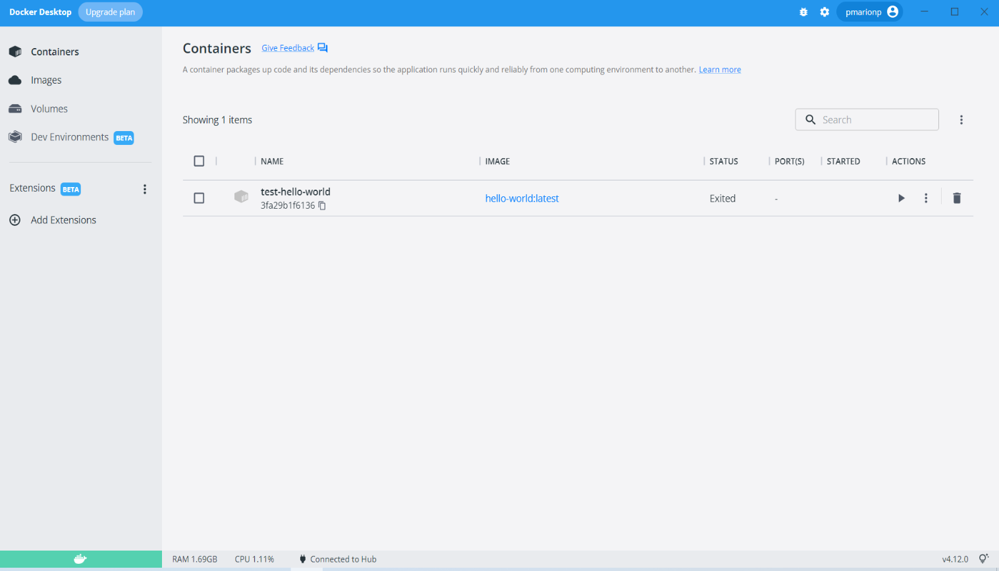

# Partie 1: premiers pas avec Docker   

## Pourquoi Docker?  
**"Mais pourtant ça marche chez moi !"**  
On a tous rencontré ce problème en travaillant sur un projet à plusieurs. Le fameux projet qui fonctionne bien chez une personne et pas chez une autre.
Le projet qui fonctionne en mode "développement" et qui ne fonctionne plus en mode "production".

  

Et si on livrait plus que du code ? Et si on livrait tout un package pour lancer notre application facilement ? 
   

## Présentation de Docker Desktop  
Docker est un outil qui permet de lancer un processus sur votre machine de façon isolée, dans un *conteneur*.    
Il peut être créé, démarré, arrêté, déplacé d'un environnement à un autre ou supprimé grâce à la CLI Docker.  
Un conteneur peut être lancé sur une machine locale, mais aussi sur une machine virtuelle ou déployé dans le cloud, ce qui offre une grande flexibilité.    
Chaque conteneur est isolé des potentiels autres conteneurs et fait tourner ses propres logiciels, binaires et ses propres configurations.  

Un conteneur est une instance executable d'une *image*.
Une image Docker fournit le système de fichier dédié pour le conteneur.  
L'image doit donc avoir tout ce dont le conteneur aura besoin pour fonctionner : 
* dépendances 
* configuration
* scripts 
* binaires
* variables d'environnement
* commandes par défaut à exécuter
* ...  

Cette image peut être stockée localement ou sur le DockerHub, et elle peut posséder un tag.  
Enfin, Docker peut tourner sur n'importe quelle OS.

  

## Commandes de base
**ATTENTION REVOIR ET UNIFIER LE VOTRE MACHINE / MA MACHINE, LE ON/VOUS/NOUS**   
Voyons ici quelques commandes basiques que nous allons réutiliser tout le long du cours.  
Cette liste est loin d'etre exhaustive, n'hésitez pas à consulter la [documentation Docker](https://docs.docker.com/) pour découvrir toutes les commandes qui sont à votre disposition !

Nous allons tester plusieurs de ces commandes avec l'image *hello-world* de Docker. Nous allons les présenter sous deux formats : en ligne de commande et via le Docker Desktop. À la fin de ce module, vous pourrez choisir ce qui vous convient le mieux au quotidien.  

  
### docker image 
Commençons avec des commandes concernant la gestion des images. 
#### docker image ls  

`docker image ls` permet de lister les images présentes sur votre Docker local.  
Lorsque vous lancez une image, le daemon Docker va rechercher l'image sur votre machine en premier. Si elle ne s'y trouve pas elle va la récupérer sur le DockerHub.  
  
Lancez la commande une première fois : si vous n'avez encore rien lancé sur votre Docker la liste des images locales devrait être vide. 

   
   
 
Maintenant, récupérez l'image *hello-world*, sans toutefois lancer le conteneur, grâce à la commande `docker pull hello-world` .

  

Listez à nouveau les conteneurs locaux : vous devriez voir apparaitre *hello-world* dans votre liste. 

   
  

Pour réaliser cette opération avec le Docker Desktop, il vous suffirait de rentrer le nom de l'image dans la barre de recherche.
  
**Avez-vous remarquez le tag associé à notre image ?**  
Et oui, si vous ne spécifiez pas de tag en particulier, Docker récupère par défaut le tag *latest* c'est à dire la dernière version de l'image. Comment faire pour récupérer un tag en particulier ?  
Les commandes Docker sont assez intuitives, il vous suffit de spécifier le <tag> ainsi : `docker pull hello-world:<tag>` .  

Récupérer l'image *hello-world* avec le tag `linux` , si vous listez à nouveau les images locales vous devez voir à présent l'image *hello-world* sous deux tags différents.  

   

####docker image rm  
Nous avons maintenant deux images *hello-world* avec deux tags différents sur notre machine. Nous allons en garder une seule pour plus de simplicité. 
Pour supprimer une image stockée en local, vous pouvez utiliser le Docker Desktop ou bien saisir la commande `docker image rm <image>:<tag>` .  
Supprimez l'image *hello-world* qui possède le tag `linux`, pour ne garder que la `latest` . Vérifiez en listant les images restantes en local.  

   
   

#### docker image prune  
Cette commande permet de faire table rase et de supprimer toutes les images locales *orphelines*, c'est-à-dire des images qui n’ont plus de références, c.a.d. plus de containers qui les reference ni d’image qui les reference, ni de tags associés .  
C'est une commande utile quand on n'a pas ouvert Docker pendant quelque temps et qu'on souhaite faire un peu de nettoyage !
Si vous souhaitez supprimer toutes les images inutilisées (et pas seulement les orphelines), il suffit d'ajouter l'option `-a` ou `--all` . Cette commande supprimera **toutes** les images qui ne sont pas utilisées, alors soyez sûrs de vous.  

   
#### docker image build    
Cette commande va nous permettre de créer une image Docker de toute pièce. Nous la verrons dans la suite de ce cours, un peu de patience ! 
Retenez juste qu'elle va s'écrire sous cette forme : ` docker image build [OPTIONS] PATH | URL | -`   

### docker container  

#### docker container run  

Commençons par lancer un conteneur. Rappelez-vous qu'un conteneur contient un processus, et c'est celui-ci que nous allons démarrer.  
La commande se présente sous cette forme : ``docker run [OPTIONS] IMAGE[:TAG|@DIGEST] [COMMAND] [ARG...]`` .  

Nous allons prendre le temps de présenter plusieurs options utiles pendant ce cours. Encore une fois, n'hésitez pas à vous référer à la [documentation Docker](https://docs.docker.com/) pour découvrir toutes les commandes qui sont à votre disposition.   

`--detach`, `-d`
Cette option permet de lancer un conteneur en arrière-plan.  

`-rm`
Cette option permet de supprimer le conteneur lorsqu'on l'éteint.  

`--name` 
Permet de donner un nom au conteneur. Par défaut un nom est attribué au conteneur, il est généré par le daemon de façon aléatoire et le résultat est parfois amusant. Toutefois, quand vous voulez vous y retrouver dans vos conteneurs, mieux vaut les nommer.   

`--publish`, `-p` 
Permet de publier un port sur la machine host. Rappelez-vous qu'un conteneur est hermétique, si nous souhaitons y accéder via un navigateur, ou si nous souhaitons faire communiquer plusieurs conteneurs, il faut que ces derniers exposent des ports.    

`--user`, `-u` 
Permet de définir un user id. Par défaut le user id est 0, ce qui correspond au user root. Définir un autre user id permet d'éviter d'avoir des droits root sur le conteneur.  

``-v``, ``--volume`` 
Permet d'associer un volume définit à un conteneur. Un volume permet de stocker les données générées par et dans le conteneur.  

Dans notre cas, nous allons lancer un conteneur grâce à l'image *hello-word*, nous allons nommer le conteneur "test-hello-world".  

  

**Félicitations, vous avez lancé votre premier conteneur Docker !**  

#### docker container ls

Comme son nom l'indique, la commande ``docker container ls`` permet de lister les conteneurs allumés.  
Cette commande peut se simplifier par ``docker ps``.  
Pour voir tous les conteneurs existants, allumés ou non, il suffit de rajouter l'option ``-a`` ou ``--all``.
Le conteneur "test-hello-world" est paramétré pour s'éteindre immédiatement. Lancez la commande pour lister les conteneurs.  

**Avez-vous remarqué le paramètre ID ?**
Parfois les noms des images ou des conteneurs sont complexes et donc sources d'erreur lors de la saisie en ligne de commande. Chaque image ou conteneur a un identifiant associé, et nous pouvons donc remplacer le nom de l'image par son ID.
Vous le trouvez lui aussi trop long ? Sachez qu'il suffit de saisir les premieres hexadécimales, si c'est assez éloquent le daemon se chargera de l'autocomplétion !  

#### docker container start et docker container stop

Ces commandes sont assez explicites : on peut (re)lancer un conteneur ou l'éteindre.  
Comme le conteneur "test-hello-world" s'éteint automatiquement, nous allons tester ici uniquement la commande ``start`` . Lancez le conteneur grâce à son ID, puis listez *tous* les conteneurs. 

  

Vous pouvez voir ici que le conteneur "test-hello-world" s'est lancé grâce à son statut.

#### docker container logs

Cette commande permet d'afficher les logs associés à un conteneur. Lancez la commande pour le conteneur "test-hello-world" et observez le résultat.  

#### docker container rm 

Cette commande vous permet de supprimer un conteneur en ajoutant à la suite le nom du conteneur ou son ID. Des options sont disponibles, dont ``-v`` ou ``--volumes`` pour supprimer les volumes associés au conteneur.

#### docker container prune

Cette commande permet de supprimer **tous** les conteneurs éteints. 

 