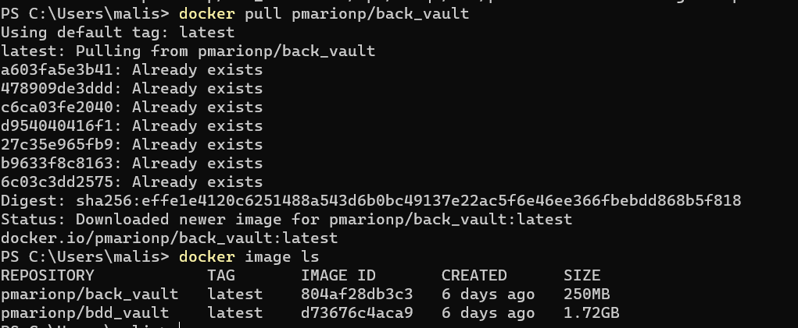
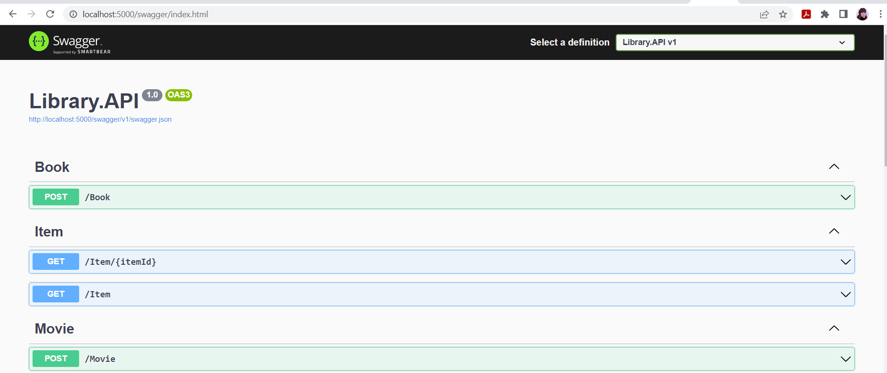
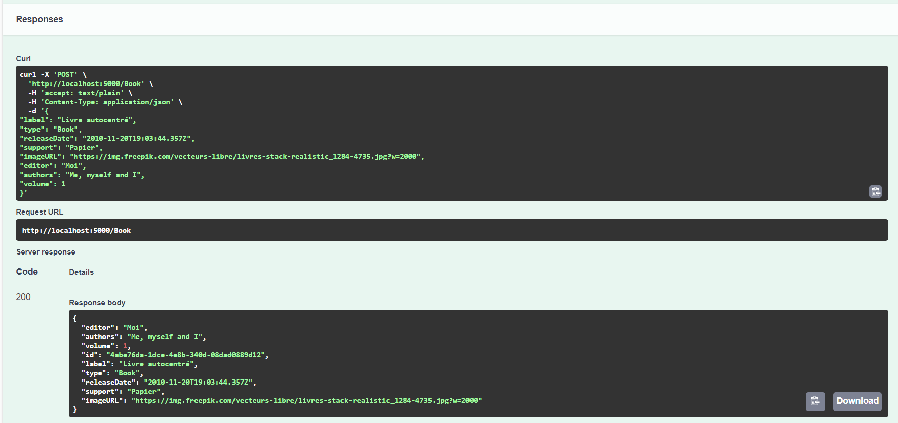

# A vous de jouer ! 


Nous allons lancer tout le long de ce module une application N-tiers.  
C'est une application de gestion de bibliothèque qui permet de stocker des collections et de les consulter.  
Cette application est assez basique et elle sera suffisante pour être le fil rouge de notre cours.  
Elle se compose en trois parties : 
- base de données
- backend .net
- frontend angular

Dans ce premier chapitre nous allons utiliser des images Docker de cette application 
afin de mettre en pratique les commandes que nous avons vues précédemment.  

## Exercice 1 pas à pas

Dans ce premier exercice nous allons récupérer une image de la base de donnée et une image du backend de l'application sur le Docker Hub.
Pour rappel, le Docker Hub est un espace de stockage et de récupération d'images Docker. Certaines images sont taguées "officielles",
et vous devez rester vigilants sur les images que vous allez récupérer. Une image maintenue régulièrement sera une image plus digne de confiance
qu'une image créée il y  a plusieurs années sans mises à jour.

### Creation du network

Dans un premier temps, nous allons créer un network sur lequel tous nos conteneurs vont interagir.
**Créez un network nommé `network_vault`.**

### La base de données

Nous allons tout d'abord récupérer [l'image Docker pmarionp/bdd_vault.](https://hub.docker.com/r/pmarionp/bdd_vault) La documentation de l'image vous donne : 
- la commande pour télécharger l'image grâce à un pull
- la commande pour lancer le conteneur

**Commençons donc par la commande ``docker pull pmarionp/bdd_vault``. 
Vous pouvez ensuite lister les images présentes sur votre Docker pour vous assurer du bon téléchargement.**

  
<br>
<br>
<br>


La commande pour lancer un conteneur pour cette image a plusieurs options que nous allons passer en revue.  
``docker run -d -p 1433:1433 --name sql-server pmarionp/bdd_vault``

``-d`` ou ``--detach`` permet de lancer le conteneur en arrière-plan, ce qui évite de devoir rouvrir un terminal de commande pour 
faire la suite des opérations.  
```-- name``` est, comme expliqué dans la documentation, un prérequis pour que la base de donnée porte un nom spécifique et non aléatoire.
Ce nom est celui défini dans les paramètres de connexion de la base de donnée au backend .net.    

`-p` ou `--publish` permet d'ouvrir un port de votre conteneur Docker afin qu'il puisse être accessible depuis le host. 
Cette option s'écrit `-p <port conteneur> : <port host>` . Dans notre cas nous avons gardé le même port mais nous aurions pu ouvrir le port 
du conteneur sur un port host totalement différent. C'est ce qui fait la force de Docker, vous pouvez changer le port host par lequel accéder à votre conteneur d'une seule ligne de commande, 
sans avoir à modifier des paramètres de l'application.

**Exécutez la commande permettant de lancer un conteneur pour l'image pmarionp/bdd_vault.
Pensez à connecter votre conteneur au network (soit dans la ligne de commande, soit dans un second temps).
Listez ensuite les conteneurs en cours d'éxécution pour vérifier du bon fonctionnement de votre commande.**


  

### Le backend .NET

Nous allons ensuite récupérer [l'image Docker pmarionp/back_vault.](https://hub.docker.com/r/pmarionp/back_vault) La documentation de l'image vous donne :
- la commande pour télécharger l'image grâce à un pull
- la commande pour lancer le conteneur

**Commençons donc par la commande ``docker pull pmarionp/back_vault``.
Vous pouvez ensuite lister les images présentes sur votre Docker pour vous assurer du bon téléchargement.**

  
<br>
<br>
<br>


La commande pour lancer un conteneur pour cette image a plusieurs options, nous allons choisir par défaut de connecter le port du conteneur au port host 5000.
Si vous choisissez un autre port, pensez à le prendre en compte dans les commandes qui suivront.

``docker run -d -p 5000:5000 pmarionp/back_vault``

**Exécutez la commande permettant de lancer un conteneur pour l'image pmarionp/bdd_vault.
Pensez à connecter votre conteneur au network (soit dans la ligne de commande, soit dans un second temps).
Listez ensuite les conteneurs en cours d'éxécution pour vérifier du bon fonctionnement de votre commande.**

  
<br>
<br>
<br>
À partir de cette étape, si vous avez bien lu la documentation de l'image pmarionp/back_vault, vous pouvez accéder au swagger du backend .NET en allant dans votre outil de
navigation favori et en allant sur l'adresse http://localhost:5000/swagger.


Afin de s'assurer de la bonne connexion entre la base de donnée et le backend, nous allons insérer un nouveau livre en base.
Cliquez sur la ligne POST/Book puis sur le bouton "Try it out". 


Insérez ensuite les données suivantes puis appuyez sur "Execute".

``
{
"label": "Livre autocentré",
"type": "Book",
"releaseDate": "2010-11-20T19:03:44.357Z",
"support": "Papier",
"imageURL": "https://img.freepik.com/vecteurs-libre/livres-stack-realistic_1284-4735.jpg?w=2000",
"editor": "Moi",
"authors": "Me, myself and I",
"volume": 1
}
``

Vous devez avoir un retour 200 de l'API ! 



